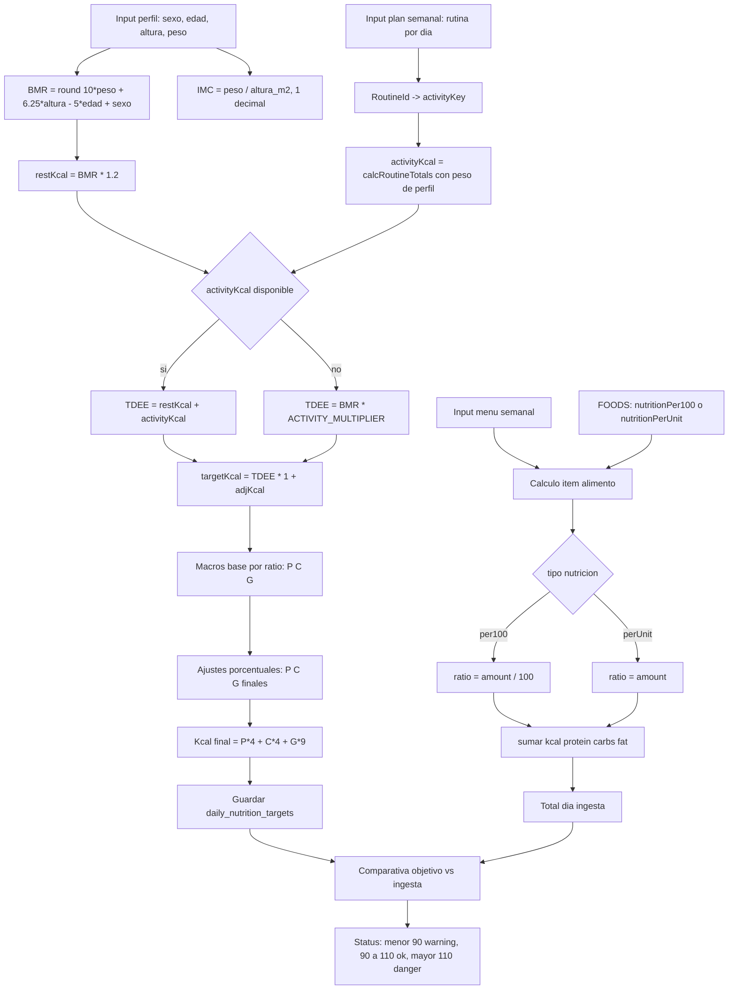

# gymjan

Prueba de concepto de una PWA con **LocalStorage** para persistir datos del usuario. Se puede usar e instalar directamente desde la URL de GitHub Pages:

`http://oscanton.github.io/gymjan`

**Qué incluye**
- **Calculadora**: calcula IMC y BMR, define objetivos calóricos y de macros por día según el plan semanal de actividad. Guarda perfil y ajustes en LocalStorage.
- **Actividad**: planificador semanal de rutinas con ejercicios, pesos y series editables. Muestra kcal y detalle de técnica. Guarda cambios por día en LocalStorage.
- **Menú**: menú semanal (desayuno/comida/cena) con cálculo de macros por comida y totales diarios. Permite editar cantidades y compara contra objetivos. Persiste en LocalStorage.
- **Lista**: genera la lista de la compra desde el menú seleccionado, agrupada por categorías y con checkboxes persistentes.
- **Control**: registro de peso con historial, actividad del día y gráfica simple en canvas. Todo queda guardado localmente.

**Cómo está organizado**
- `index.html` y `views/`: páginas principales de la app.
- `js/app.js`: bootstrap que inicializa cada página.
- `js/core/`: lógica compartida (configuración, cálculos, almacenamiento, UI, rutinas).
- `js/pages/`: lógica específica de cada vista.
- `js/data/`: datos estáticos de alimentos, menús y rutinas.

**PWA**
- `manifest.json`: configuración de instalación.
- `sw.js`: Service Worker que cachea los recursos para uso offline.

**Flujo de objetivos semanales (Mermaid)**

